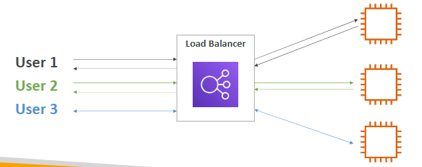
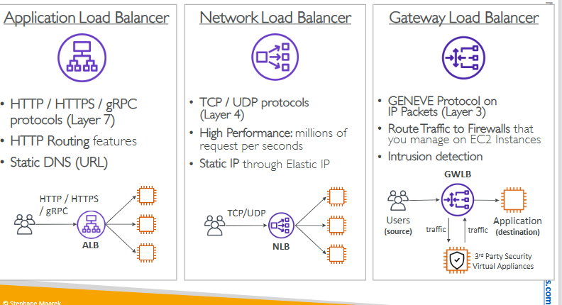
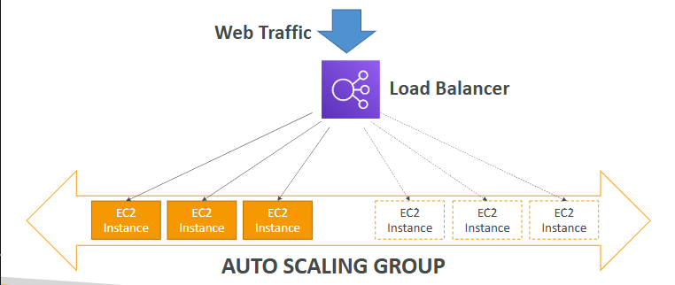

# Elastic Load Balancing & Auto Scaling Groups

## Scalability & High Availability

* Scalability: ability to accommodate a larger load by making the hardware stronger (scale up), or by adding nodes (scale out)

    * Vertical Scalability: means increasing the size of the instance (common for non distributed systems, such as a database)

    * Horizontal Scalability: means increasing the number of instances / systems for your application (common for web applications / modern applications)

* High Availability: means running your application / system in at least 2 Availability Zones (survive a data center loss)

* Elasticity: once a system is scalable, elasticity means that there will be some “auto-scaling” so that the system can scale based on the load. This is “cloud-friendly”: pay-per-use, match demand, optimize costs.

* Agility: (not related to scalability - distractor) new IT resources are only a click away, which means that you reduce the time to make those resources available to your developers from weeks to just minutes.

## Elastic Load Balancer

Load balancers: servers that forward internet traffic to multiple servers (EC2 Instances) downstream.

-> expose a single point of access (DNS) to your application

ELB: managed load balancer (AWS takes care of upgrades maintenance, high availability)

-> supports health checks

Load balancers offered by AWS:

* Application Load Balancer (HTTP / HTTPS only) – Layer 7
* Network Load Balancer (ultra-high performance, allows for TCP) – Layer 4
* Gateway Load Balancer – Layer 3

## Auto Scaling Groups

-> implement Elasticity for your application, across multiple AZ

-> scale EC2 instances based on the demand on your system, replace unhealthy

-> integrated with the ELB

Scaling Strategies:

* Manual Scaling: Update the size of an ASG manually
* Dynamic Scaling: Respond to changing demand:
    * Simple / Step Scaling (when a CloudWatch alarm is triggered)
    * Target Tracking Scaling (I want the average ASG CPU to stay at around 40%)
    * Scheduled Scaling (anticipate a scaling based on known usage patterns)
    * Predictive Scaling (uses Machine Learning to predict future traffic ahead of time)

