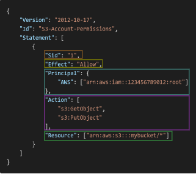

# Identity and Access Management (Global Service)

## Users, Groups, Policies

-> root account is created by default (not shared)

-> create users (people from your organization) who can be grouped (recommanded)

-> can be assigned JSON documents called policies (permissions of an user or group) => least privilege principle: don’t give more permissions than a user needs

## Policies Structure

* Consists of:
    * Version: policy language version, always include “2012-10-
    17”
    * Id: an identifier for the policy (optional)
    * Statement: one or more individual statements (required)
* Statements consists of:
    * Sid: an identifier for the statement (optional)
    * Effect: whether the statement allows or denies access 
    (Allow, Deny)
    * Principal: account/user/role to which this policy applied to
    * Action: list of actions this policy allows or denies
    * Resource: list of resources to which the actions applied to
    * Condition: conditions for when this policy is in effect 
    (optional)

## Multi Factor Authentication - MFA

-> you want to protect your Root Accounts and IAM users

-> you can setup a password policy

-> MFA = password you know + security device you own

-> if a password is stolen or hacked, the account is not compromised (they need to have access on your security device)

## AWS Access Key, CLI ans SDK

To access AWS, you have three options:
* AWS Management Console (protected by password + MFA)
* AWS Command Line Interface (CLI): protected by access keys
* AWS Software Developer Kit (SDK) - for code: protected by access keys

-> Access Keys are generated through the AWS Console

-> AWS CLI: a tool that enables you to interact with AWS services using commands in your command-line shell

-> AWS SDK: enables you to access and manage AWS services programmatically (language-specific APIs)

## IAM Roles

-> assign permissions to AWS services

-> it's like adding permissions to an user, but you will add to an service that will perform actions on your behalf

## IAM Security Tools

* IAM Credentials Report (account-level) -> a report that lists all your account's users and the status of their various credentials
* IAM Access Advisor (user-level) -> Access advisor shows the service permissions granted to a user and when those services were last accessed

## Shared Responsibility Model

AWS Responsability:
* Infrastructure (global network security)
* Configuration and vulnerability analysis
* Compliance validation

User Responsability:
* Users, Groups, Roles, Policies management and monitoring
* Enable MFA on all accounts
* Rotate all your keys often
* Use IAM tools to apply appropriate permissions
* Analyze access patterns & review permissions 
