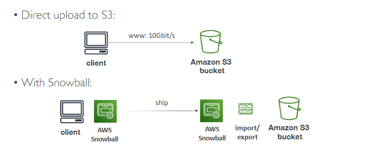
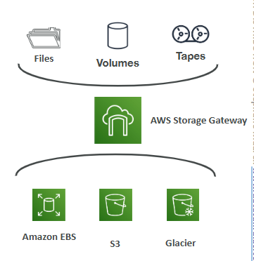

# Amazon S3

-> allows people to store objects (files) in "buckets" (directories)

-> buckets are defined at the region level

-> global unique name

-> object values are the content of the body (max 50TB, if uploading more than 5GB, must use “multi-part upload”)

-> metadata: list of text key / value pairs – system or user metadata 

-> tags: useful for security / lifecycle

-> version ID: if versioning is enabled

## S3 Security

* User-Based:
    * IAM Policies - which API calls should be allowed for a specific use
* Resource-Based:
    * Bucket Policies - bucket wide rules from the S3 console
    * Object Access Control List (ACL) – finer grain (can be disabled)
    * Bucket Access Control List (ACL) – less common (can be disabled)

-> encrypt objects in Amazon S3 using encryption keys

## S3 Website

-> host static websites on S3 and have them accessible on 
the Internet

-> if you get a 403 Forbidden error, make sure the bucket 
policy allows public reads

## S3 Versioning

-> enabled at the bucket level

-> protect against unintended deletes (ability to restore a version)

-> easy roll back to previous version

-> suspending versioning does not delete the previous versions

## S3 Replication

-> must enable Versioning in source and destination buckets

-> buckets can be in different AWS accounts

-> must give proper IAM permissions to S3

* Cross-Region Replication (CRR): compliance, lower latency access, replication across accounts
* Same-Region Replication (SRR): log aggregation, live replication between production and test accounts

## S3 Storage

* Amazon S3 Standard - General Purpose

    -> used for frequently accessed data

    -> low latency and high throughput

    -> sustain 2 concurrent facility failures

* Amazon S3 Standard-Infrequent Access (IA)

    -> for data that is less frequently accessed, but requires rapid access when needed

    -> lower cost than S3 Standard

    -> disaster recovery, backups

* Amazon S3 One Zone-Infrequent Access

    -> storing secondary backup copies of on-premise data, or data you can recreate

* Amazon S3 Glacier Storage Classes

    -> low-cost object storage meant for archiving / backup

    -> pricing: price for storage + object retrieval cost

    * Amazon S3 Glacier Instant Retrieval

        -> millisecond retrieval, great for data accessed once a quarte

        -> minimum storage duration of 90 days

    * Amazon S3 Glacier Flexible Retrieval

        -> Expedited (1 to 5 minutes), Standard (3 to 5 hours), Bulk (5 to 12 hours) – free

        -> minimum storage duration of 90 days

    * Amazon S3 Glacier Deep Archive

        -> Standard (12 hours), Bulk (48 hours)

        -> minimum storage duration of 180 days

* Amazon S3 Intelligent Tiering

    -> small monthly monitoring and auto-tiering fee

    -> moves objects automatically between Access Tiers based on usage

    -> there are no retrieval charges in S3 Intelligent-Tiering

    * Frequent Access tier (automatic): default tier
    * Infrequent Access tier (automatic): objects not accessed for 30 days
    * Archive Instant Access tier (automatic): objects not accessed for 90 days
    * Archive Access tier (optional): configurable from 90 days to 700+ days
    * Deep Archive Access tier (optional): config. from 180 days to 700+ days

* S3 Express One Zone

    -> high performance, single Availability Zone storage class

    -> objects stored in a Directory Bucket (bucket in a single AZ)

    -> handle 100,000s requests per second with single-digit millisecond latency

    -> Up to 10x better performance than S3 Standard (50% lower costs)

## IAM Access Analyzer

-> ensures that only intended people have access to your S3 buckets

-> evaluates S3 Bucket Policies, S3 ACLs, S3 Access Point Policies

## AWS Snowball

-> highly-secure, portable devices to collect and process data at the edge, and migrate data into and out of AWS

-> helps migrate up to Petabytes of data

-> Edge Computing: process data while it’s being created on an edge location

-> you pay for  device usage and data transfer out of AWS 

## AWS Storage Gateway

-> hybrid storage service to allow on-premises to seamlessly use the AWS Cloud 

-> bridge between on-premise data and cloud data in S3

