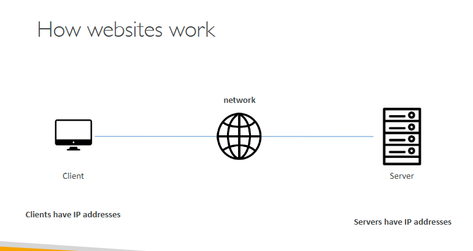
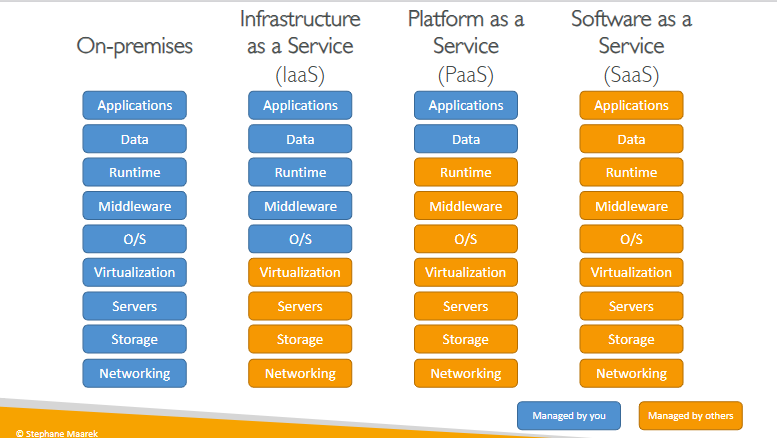

# Cloud Computing

## What is Cloud Computing ?

Cloud computing is the on-demand delivery of compute power, database storage, applications, and other IT resources.

Cloud computing means using IT resources over the internet instead of owning and maintaining all physical infrastructure. AWS can reduce upfront hardware costs, improve scalability, and allow the company to focus more on business operations.

With AWS, security is shared: AWS protects the cloud infrastructure, while the customer protects their data, users, permissions, and applications. The best approach is to start with a small pilot, monitor cost and security, and expand only where there is clear business value.

Types of Cloud Computing:

* Infrastructure as a Service:
    * Amazon EC2 (on AWS)
    * GCP, Azure, Rackspace, Digital Ocean, Linode
* Platform as a Service:
    * Elastic Beanstalk (on AWS)
    * Heroku, Google App Engine (GCP), Windows Azure (Microsoft)
* Software as a Service:
    * Many AWS services (ex: Rekognition for Machine Learning)
    * Google Apps (Gmail), Dropbox, Zoom

Tour of the AWS Console:
* AWS has Global Services:
    * Identity and Access Management (IAM)
    * Route 53 (DNS service)
    * CloudFront (Content Delivery Network)
    * WAF (Web Application Firewall)
* Most AWS services are Region-scoped:
    * Amazon EC2 (Infrastructure as a Service)
    * Elastic Beanstalk (Platform as a Service)
    * Lambda (Function as a Service)
    * Rekognition (Software as a Service)
* Region Table: https://aws.amazon.com/about-aws/global-infrastructure/regional-product-services 

The AWS Shared Responsibility Model explains that AWS is responsible for security of the cloud, meaning the physical data centers, hardware, networking, and core infrastructure. The customer is responsible for security in the cloud, such as managing users, permissions, data, operating systems, applications, and service configurations.

The AWS Acceptable Use Policy defines what customers are not allowed to do when using AWS services, such as illegal activity, security abuse, spam, harmful content, or actions that disrupt other users. In simple terms, it is AWS’s rulebook for using its cloud services safely, legally, and responsibly.

