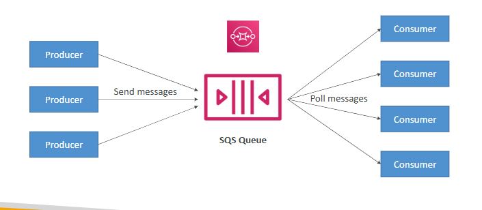
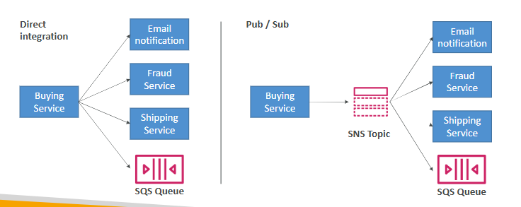
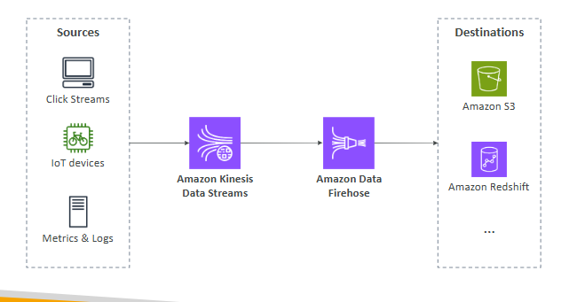

# Cloud Integration

-> synchronous between applications can be problematic if there are sudden spikes of traffic

-> it’s better to decouple your applications

## Amazon SQS

-> queue service in AWS

-> multiple Producers, messages are kept up to 14 days

-> multiple Consumers share the read and delete messages when done

-> used to decouple applications in AWS

## Amazon SNS

-> notification service in AWS

-> subscribers: Email, Lambda, SQS, HTTP, Mobile...

-> multiple Subscribers, send all messages to all of them

-> no message retention

## Amazon Kinesis Data Streams

-> real-time big data streaming

-> collect, process, and analyze real-time streaming data 
at any scale

## Amazon MQ

-> managed message broker for ActiveMQ and RabbitMQ in the cloud (MQTT, AMQP.. protocols)

-> doesn’t “scale” as much as SQS / SNS

-> has both queue feature (~SQS) and topic features (~SNS)