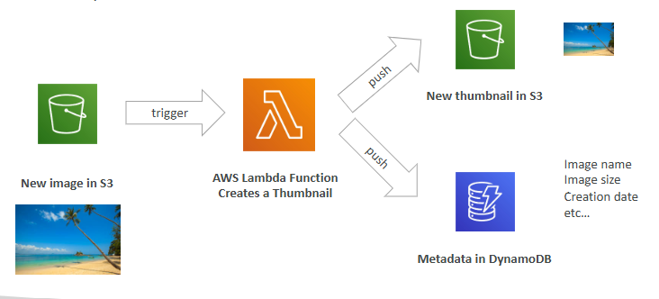
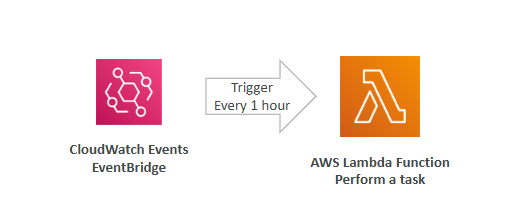
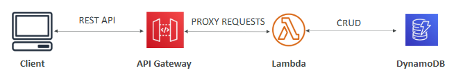

# Elastic Container Service (ECS)

## Docker

-> software development platform to deploy apps

-> apps are packaged in containers that can be run on any OS

-> scale containers up and down very quickly

-> Docker images are stored in Docker Repositories =>  Amazon ECR (Elastic Container Registry)

## ECS

-> launch Docker containers on AWS

-> you must provision & maintain the infrastructure (the EC2 instances)

-> AWS takes care of starting / stopping containers

-> has integrations with the Application Load Balancer

## Fargate

-> same as ECS

-> you do not provision the infrastructure (no EC2 instances to manage)

-> serverless offering

## ECR (Elastic Container Registry)

-> private Docker Registry on AWS

-> this is where you store your Docker images so they can be run by ECS or Fargate

## EKS (Elastic Kubernetes Service)

-> allows you to launch managed Kubernetes clusters on AWS

-> Kubernetes is an open-source system for management deployment, and scaling of containerized apps

-> Kubernetes is cloud-agnostic => can be used in any cloud

# AWS Lambda

## Serverless

-> developers don’t have to manage servers anymore

-> they just deploy code/functions

->  pioneered by AWS Lambda but now also includes anything that’s managed: “databases, messaging, storage, etc.” => S3, DynamoDB, Fargate, Lambda

## Lambda

-> virtual functions – no servers to manage

-> limited by time - short executions

-> scaling is automated

-> easy pricing => pay per request (calls) and compute time (duration)

-> Event-Driven: functions get invoked by AWS when needed

## AWS API Gateway

-> fully managed service for developers to easily create, publish, maintain, monitor, and secure APIs

-> serverless and scalable

-> supports RESTful APIs and WebSocket APIs, security, user authentication

-> expose Lambda functions as HTTP API

## AWS Batch

-> fully managed batch processing at any scale

-> a “batch” job is a job with a start and an end (opposed to continuous)

-> batch will dynamically launch EC2 instances or Spot Instances

-> batch jobs are defined as Docker images and run on ECS, EKS, Fargate

-> helpful for cost optimizations and focusing less on the infrastructure

## Batch vs Lambda

Lambda:
* Time limit
* Limited runtimes
* Limited temporary disk space
* Serverless

Batch:
* No time limit
* Any runtime as long as it’s packaged as a Docker image
* Rely on EBS / instance store for disk space
* Relies on EC2 (can be managed by AWS)

## Amazon Lightsail

-> virtual servers, storage, databases, and networking 

-> low & predictable pricing

-> great for people with little cloud experience

-> has high availability but no auto-scaling, limited AWS integrations