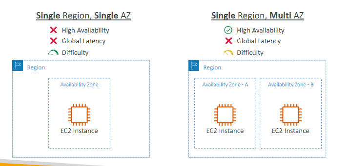
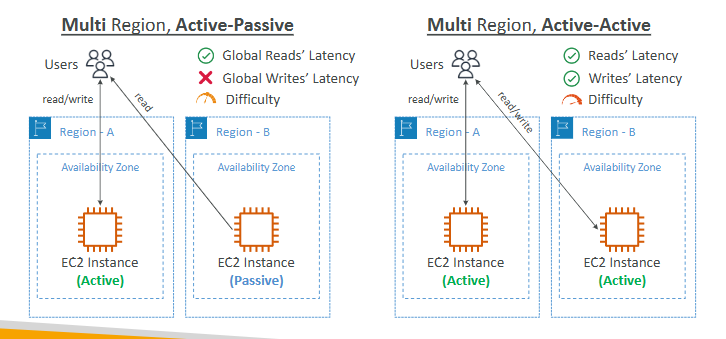
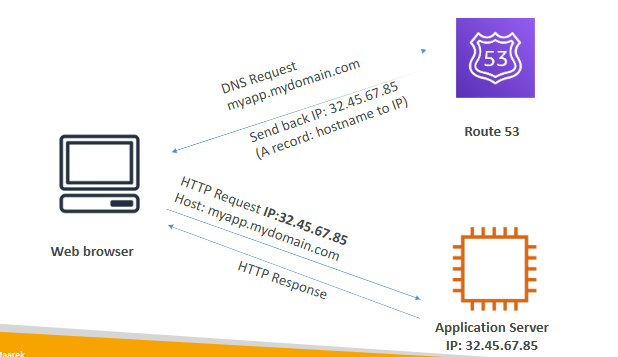
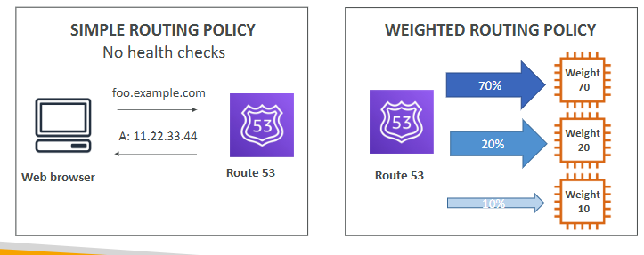
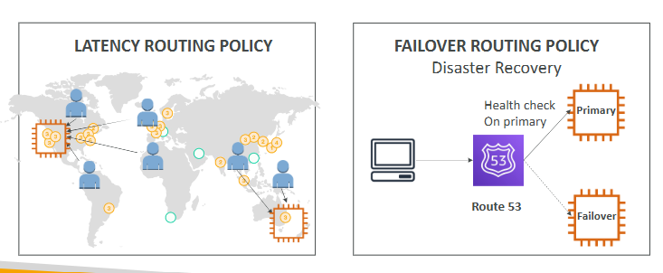
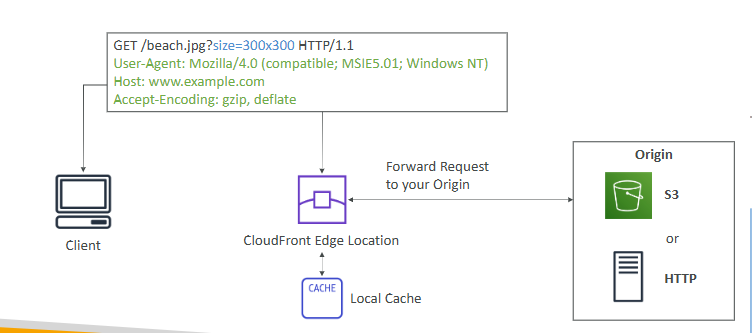
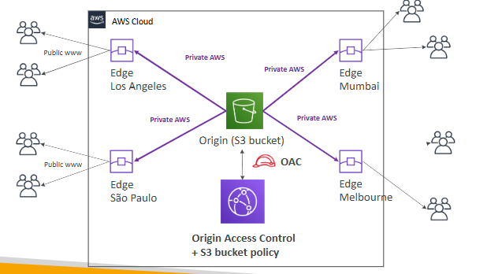
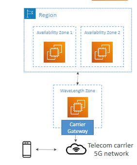

# Global Aplication

-> application deployed in multiple geographies (Regions and / or Edge Locations)

-> Decreased Latency / Disaster Recovery (DR) / Attack protection

## Amazon Route 53

-> is a Managed DNS (Domain Name System)

-> DNS is a collection of rules and records which helps clients understand how to reach a server through URLs

### Route 53 Routing Policies

## Amazon CloudFront

-> Content Delivery Network (CDN)

-> improves read performance, content is cached at the edge

-> DDoS protection (because worldwide), integration with Shield, AWS Web Application Firewall 

### CloudFront vs S3 Cross Region Replication

CloudFront:
* Global Edge network
* Files are cached for a TTL (maybe a day)
* Great for static content that must be available everywhere

S3 Cross Region Replication:
* Must be setup for each region you want replication to happen
* Files are updated in near real-time
* Read only
* Great for dynamic content that needs to be available at low-latency in few regions

## S3 Transfer Acceleration

-> increase transfer speed by transferring file to an AWS edge location which will forward the data to the S3 bucket in the target region

## AWS Global Accelerator

-> improve global application availability and performance using the AWS global network

-> no caching, proxying packets at the edge to applications running in one or more AWS Regions.

-> improves performance for a wide range of applications over TCP or UDP

## AWS Outposts

-> Hybrid Cloud: businesses that keep an on-premises infrastructure alongside a cloud infrastructure

-> “server racks” that offers the same AWS infrastructure,services, APIs & tools to build your own applications on-premises just as in the cloud

-> you are responsible for the Outposts Rack physical security

## AWS WaveLength

->  infrastructure deployments embedded within the telecommunications providers’ datacenters at the edge of the 5G networks

## AWS Local Zones

-> places AWS compute, storage, database, and other selected AWS services closer to end users to run latency-sensitive applications

-> extension of an AWS Region