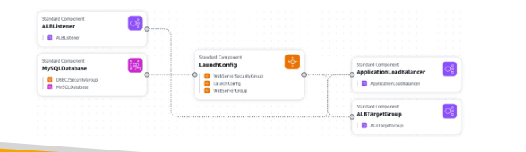
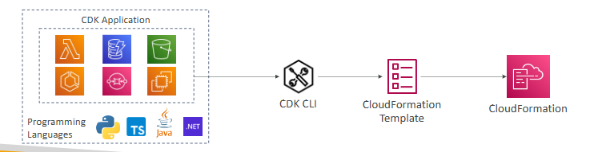
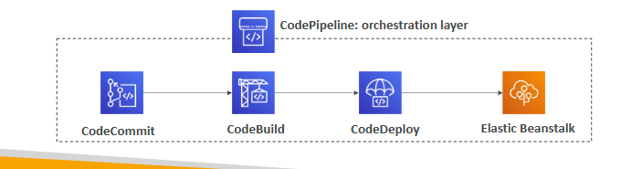
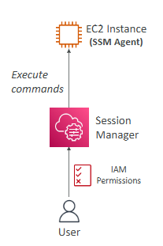

# CloudFormation

-> declarative way of outlining your AWS Infrastructure, for any resources

-> creates services for you, in the right order, with the 
exact configuration that you specify

-> Infrastructure as code => no resources are manually created, which is excellent for control, changes to the infrastructure are reviewed through code

-> Cost => each resources within the stack is tagged with an identifier so you can easily see how much a stack costs you and you can estimate the costs of your resources using the CloudFormation template

-> leverage existing templates on the web / documentation

-> Infrastructure Composer: we can see all the resources and the relations between the components

# AWS Cloud Development Kit (CDK)

-> define your cloud infrastructure using a familiar language

-> the code is “compiled” into a CloudFormation template (JSON/YAML)

-> you can therefore deploy infrastructure and application runtime code together

# AWS Elastic Beanstalk

-> developer centric view of deploying an application on AWS

-> have full control over the configuration

-> Platform as a Service (PaaS)

-> is free but you pay for the underlying instances

-> just the application code is the responsibility of the developer

Three architecture models:
* Single Instance deployment: good for dev
* LB + ASG: great for production or pre-production web applications
* ASG only: great for non-web apps in production (workers, etc..)

## Health Monitoring

-> health agent pushes metrics to CloudWatch

-> checks for app health, publishes health events

# Developer Services

## AWS CodeDeploy

-> we want to deploy our application automatically

-> works with EC2/ On-Premises Servers/ Hybrid Service

-> must be provisioned and configured ahead of time with the CodeDeploy Agent

## AWS CodeCommit

-> source-control service that hosts Git-based repositories

-> the code changes are automatically versioned

-> Private, Secured, Integrated with AWS

## AWS CodeBuild

-> compiles source code, run tests, and produces packages that are ready to be deployed (by CodeDeploy for example)

Benefits: 
* Fully managed, serverless
* Continuously scalable & highly available
* Secure
* Pay-as-you-go pricing – only pay for the build time

## AWS CodePipeline

-> orchestrate the different steps to have the code automatically pushed to production

-> basis for CICD (Continuous Integration & Continuous Delivery)

-> fully managed, compatible with CodeCommit, CodeBuild, CodeDeploy, Elastic Beanstalk, CloudFormation, GitHub, 3rd-party services (GitHub...) & custom plugins

## AWS CodeArtifact

-> storing and retrieving dependencies is called artifact management

-> CodeArtifact is a secure, scalable, and cost-effective artifact management for software development

-> works with common dependency management tools such as Maven, Gradle, npm, yarn, twine, pip, and NuGet

-> Developers and CodeBuild can then retrieve dependencies straight from CodeArtifact

# AWS Systems Manager (SSM)

-> helps you manage your EC2 and On-Premises systems at scale

-> hybrid AWS service

-> patching automation for enhanced compliance

-> run commands across an entire fleet of servers 

-> store parameter configuration with the SSM Parameter Store

## SSM Session Manager

-> allows you to start a secure shell on your EC2 and on-premises servers

-> no SSH access, bastion hosts, or SSH keys needed

-> no port 22 needed (better security)

## Systems Manager Parameter Store

-> secure storage for configuration and secrets

-> API Keys, passwords, configurations...

-> serverless, scalable, durable, easy SDK

-> control access permissions using IAM

-> version tracking & encryption (optional)