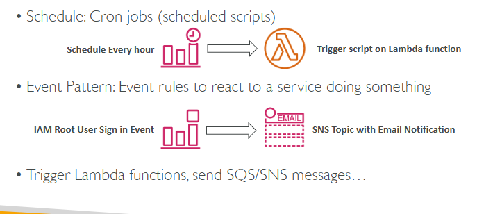
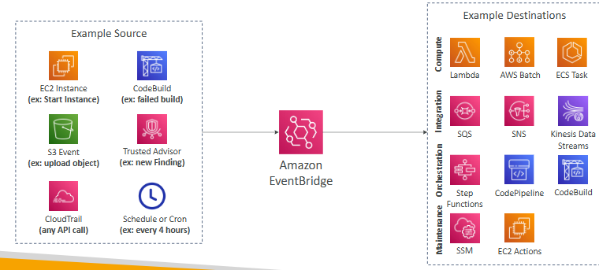
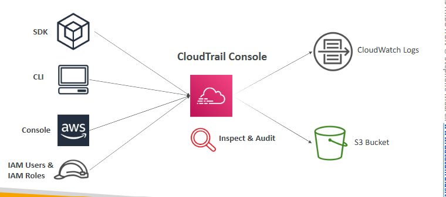
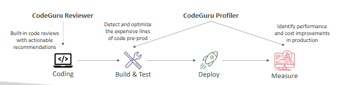

# Amazon CloudWatch

## Metrics

-> provides metrics for every services in AWS

-> have timestamps

-> can create CloudWatch dashboards of metrics

Important Metrics:

* EC2 instances
* EBS volumes
* S3 buckets
* Billing
* Service Limits
* Custom metrics

## Alarms

-> used to trigger notifications for any metric

Alarms actions:
* Auto Scaling: increase or decrease EC2 instances “desired” count
* EC2 Actions: stop, terminate, reboot or recover an EC2 instance
* SNS notifications: send a notification into an SNS topic

-> Alarm States: OK. INSUFFICIENT_DATA, ALARM

## Logs

Collect log from:
* Elastic Beanstalk: collection of logs from application
* ECS: collection from containers
* AWS Lambda: collection from function logs
* CloudTrail based on filter
* CloudWatch log agents: on EC2 machines or on-premises servers
* Route53: Log DNS queries

-> you need to run a CloudWatch agent on EC2 to push the log files you want

-> make sure IAM permissions are correct

## EventBridge

# AWS CloudTrail

-> provides governance, compliance and audit for your AWS Account

-> get an history of events / API calls made within your AWS Account 

-> can put logs from CloudTrail into CloudWatch Logs or S3

-> a trail can be applied to All Regions (default) or a single Region

-> if a resource is deleted in AWS, investigate CloudTrail first

# AWS X-Ray

Debugging in Production, the good old way:
* Test locally
* Add log statements everywhere
* Re-deploy in production

# Amazon CodeGuru

-> an ML-powered service for automated code reviews and application performance recommendations

Provides two functionalities
* CodeGuru Reviewer: automated code reviews for static code analysis (development)
* CodeGuru Profiler: visibility/recommendations about application performance during runtime (production)

# AWS Health Dashboard

## Service History

-> shows all regions, all services health

-> shows historical information for each day

## Your Account

-> alerts and remediation guidance when AWS is experiencing events that may impact you

-> gives you a personalized view into the performance and availability of the AWS services underlying your AWS resources.
