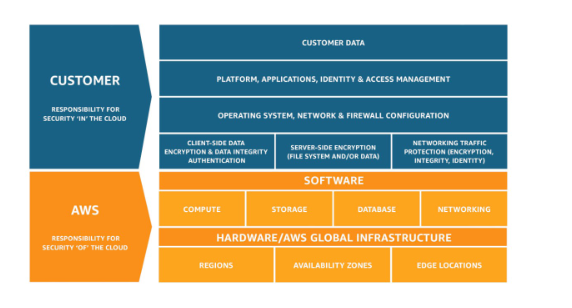
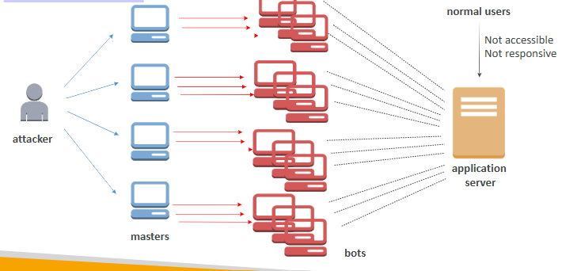
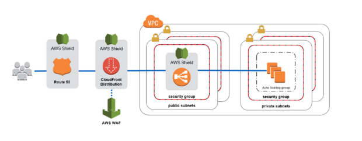
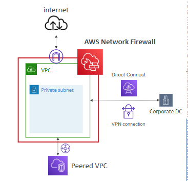
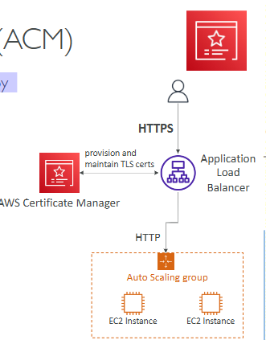
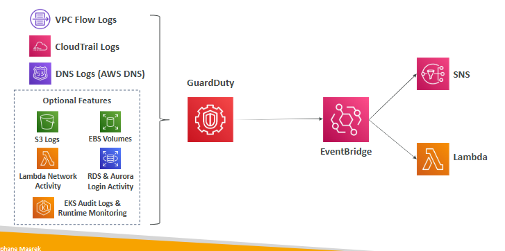
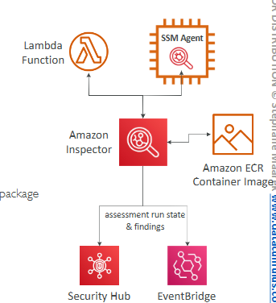
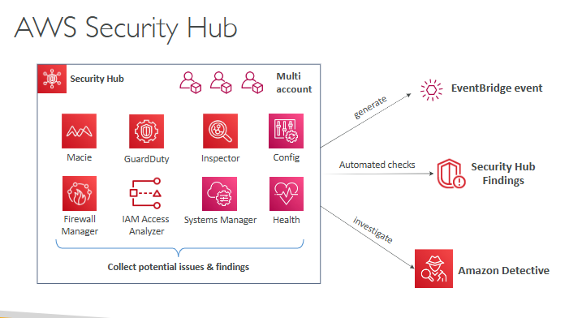

# AWS Shared Responsibility Model

* AWS responsibility => Security of the Cloud
* Customer responsibility => Security in the Cloud
* Shared controls => Patch Management, Configuration Management, Awareness & Training

# DDOS Attack (Distributed Denial-of-Service)

DDOS Protection on AWS: 

* AWS Shield Standard: protects against DDOS attack for your website and applications, for all customers at no additional costs
* AWS Shield Advanced: 24/7 premium DDoS protection against more sophisticated attack
* AWS WAF (Web Application Firewall): Filter specific requests based on rules for protection, deploy on Application Load Balancer, API Gateway, CloudFront
* CloudFront and Route 53: 
    * Availability protection using global edge network
    * Combined with AWS Shield, provides attack mitigation at the edge
* Be ready to scale – leverage AWS Auto Scaling

# AWS Network Firewall

-> protect your entire Amazon VPC

## AWS Firewall Manager

-> manage security rules in all accounts of an AWS Organization

-> rules are applied to new resources as they are created (good for compliance) across all and future accounts in your Organization

# Penetration Testing

-> customers are welcome to carry out security assessments or penetration tests against their AWS infrastructure

Prohibited Activities
* DNS zone walking via Amazon Route 53 Hosted Zones
* Denial of Service (DoS), Distributed Denial of Service (DDoS), Simulated DoS, Simulated DDoS
* Port flooding
* Protocol flooding
* Request flooding (login request flooding, API request flooding)

# Encryption

* Data at rest: data stored or archived on a device
* Data in transit (in motion): data being moved from one location to another => network

-> we want to encrypt data in both states to protect it

-> for this we leverage encryption keys

## AWS KMS (Key Management Service)

-> AWS manages the encryption keys for us

-> Encryption Automatically enabled: 

* CloudTrail Logs
* S3 Glacier
* Storage Gateway

## CloudHSM

-> AWS provisions encryption hardware

-> you manage your own encryption keys entirely

## Types of KMS Keys

* Customer Managed Key: create, manage and used by the customer, can enable or disable
* AWS Managed Key: created, managed and used on the customer’s behalf by AWS
* AWS Owned Key: collection of CMKs that an AWS service owns and manages to use in multiple accounts
* CloudHSM Keys (custom keystore): keys generated from your own CloudHSM hardware device

# AWS Certificate Manager (ACM)

-> provision, manage, and deploy SSL/TLS Certificates

# AWS Secrets Manager

-> storing secrets

-> capability to force rotation of secrets every X days

-> automate generation of secrets on rotation 

-> secrets are encrypted using KMS

# AWS Artifact 

-> portal that provides customers with on-demand access to AWS compliance documentation and AWS agreements (ISO Certifications)

-> can be used to support internal audit or compliance

* Artifact Reports: allows you to download AWS security and compliance documents
* Artifact Agreements:  allows you to review, accept, and track the status of AWS agreements

# Amazon GuardDuty

-> Intelligent Threat discovery to protect your AWS Account => Machine Learning algorithms, anomaly detection, 3rd party data

-> can setup EventBridge rules to be notified in case of findings

# Amazon Inspector

-> Automated Security Assessments for EC2 instances, Container Images push to Amazon ECR, Lambda Functions

-> reporting & integration with AWS Security Hub

-> send findings to Amazon Event Bridge

-> continuous scanning of the infrastructure, only when needed

-> a risk score is associated with all vulnerabilities for prioritization

# AWS Config

-> helps with auditing and recording compliance of your AWS resources

-> helps record configurations and changes over time

-> you can receive alerts (SNS notifications) for any changes

-> per-region service

-> can be aggregated across regions and accounts

# AWS Macie

-> is a fully managed data security and data privacy service that uses machine learning and pattern matching to discover and protect your sensitive data in AWS

-> helps identify and alert you to sensitive data, such as personally identifiable information

# AWS Security Hub

-> central security tool to manage security across several AWS accounts and automate security checks

-> integrated dashboards showing current security and compliance status to quickly take actions

# Amazon Detective

-> analyzes, investigates, and quickly identifies the root cause of security issues or suspicious activities (using ML and graphs)

-> automatically collects and processes events from VPC Flow Logs, CloudTrail, GuardDuty and create a unified view

# AWS Abuse

-> report suspected AWS resources used for abusive or illegal purposes

# Root user privileges

Actions that can be performed only by the root user:
* Change account settings
* Close your AWS account
* Change or cancel your AWS Support plan
* Register as a seller in the Reserved Instance Marketplace

# IAM Access Analyzer

-> find out which resources are shared externally

-> define Zone of Trust = AWS Account or AWS Organization

-> access outside zone of trusts => findings