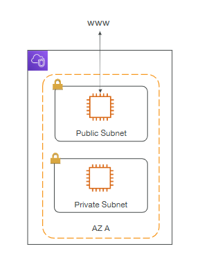
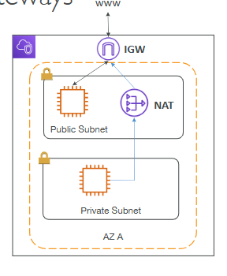
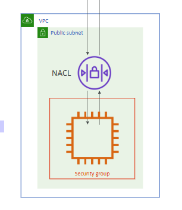
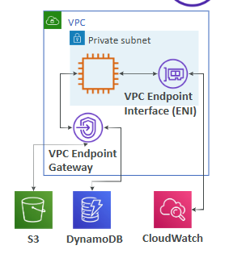
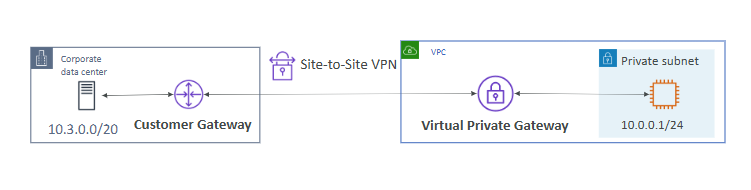

# VPC & Networking

## IP Addresses in AWS

* IPv4 – Internet Protocol version 4
    * Public IPv4 – can be used on the Internet
    * EC2 instance gets a new public IP address every time you stop then start it
    * Private IPv4 – can be used on private networks (LAN) such as internal AWS networking (fixed for EC2)
* Elastic IP – allows you to attach a fixed public IPv4 address to EC2 instance
* IPv6 – Internet Protocol version 6
    * Every IP address is public in AWS (no private range)
    * Free

## VPC & Subnets Primer

* VPC - Virtual Private Cloud: private network to deploy your resources (regional resource)
* Subnets allow you to partition your network inside your VPC (Availability Zone resource)
* A public subnet is a subnet that is accessible from the internet
* A private subnet is a subnet that is not accessible from the internet
* To define access to the internet and between subnets, we use Route Tables.

## Internet Gateway & NAT Gateways

* Internet Gateways helps our VPC instances connect with the internet
* Public Subnets have a route to the internet gateway.
* NAT Gateways (AWS-managed) & NAT Instances (self-managed) allow your instances in your Private Subnets to access the internet while remaining private

## Network ACL & Security Groups

NACL (Network ACL)
* A firewall which controls traffic from and to subnet
* Can have ALLOW and DENY rules
* Are attached at the Subnet level
* Rules only include IP addresses

Security Groups
* A firewall that controls traffic to and from an EC2 
Instance
* Can have only ALLOW rules
* Rules include IP addresses and other security groups

## VPC Flow Logs

-> capture information about IP traffic going into your interfaces

-> helps to monitor & troubleshoot connectivity issues

-> captures network information from AWS managed interfaces too

-> data can go to S3, CloudWatch Logs, and Amazon Data Firehose

## VPC Peering

-> connect two VPC, privately using AWS’ network

-> must not have overlapping CIDR (IP address range)

-> connection is not transitive

## VPC Endpoints

-> allow you to connect to AWS Services using a private network instead of the public www network

-> gives you enhanced security and lower latency to access AWS services

* VPC Endpoint Gateway: S3 & DynamoDB
* VPC Endpoint Interface: most services (including S3 & DynamoDB)

## AWS PrivateLink

-> most secure & scalable way to expose a service to 1000s of VPCs

-> does not require VPC peering, internet gateway, NAT, route tables

-> requires a network load balancer (Service VPC) and ENI (Customer VPC)

## Site to Site VPN & Direct Connect

Site to Site VPN:
* Connect an on-premises VPN to AWS
* The connection is automatically encrypted
* Goes over the public internet

Direct Connect (DX):
* Establish a physical connection between on-premises and AWS
* The connection is private, secure and fast
* Goes over a private network
* Takes at least a month to establish

## AWS Client VPN

-> connect from your computer using OpenVPN to your private network in AWS and on-premises

-> allow you to connect to your EC2 instances over a private IP (just as if you were in the private VPC network)

## Transit Gateway

-> for having transitive peering between thousands of VPC and on-premises, hub-and-spoke (star) connection

-> one single Gateway to provide this functionality